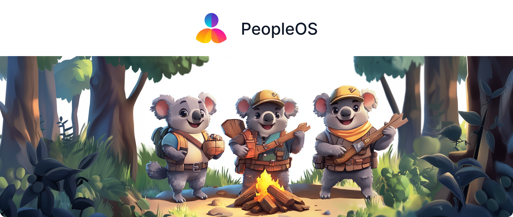
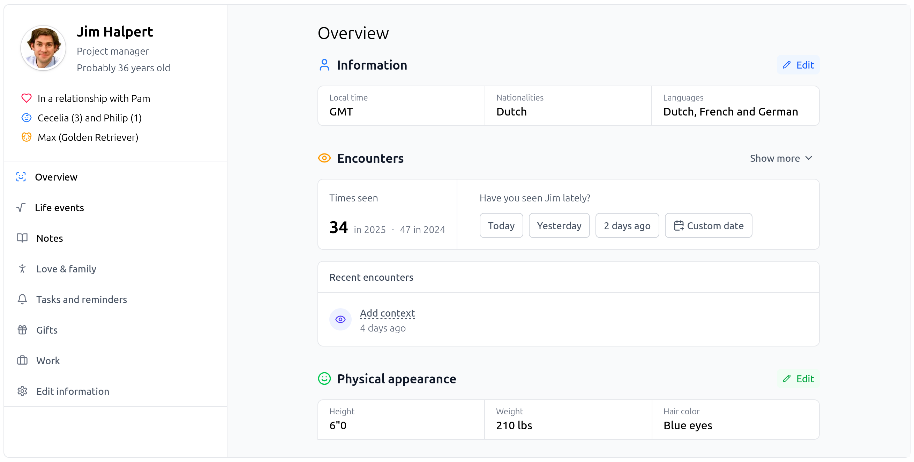

<p align="center">
  <a href="https://github.com/djaiss/peopleos">
   
  </a>

  <p align="center">
    A simple, bullshit and AI-free, open-source personal CRM.
  </p>

  <p align="center">
    <a href="https://codecov.io/gh/djaiss/peopleOS">
      
    </a>
    <a href="https://opensource.org/licenses/MIT">
      
    </a>
  </p>
</p>

## What is this?

PeopleOS is the spiritual successor to Monica, the personal CRM.

<p align="center">
    
</p>

### Features

- A powerful contact management system with features like adding family information, work information, etc.
- A powerful and fully customizable journal system that lets you document your life.

Data is also fully encrypted at rest, which is nice in case someone wants to peek into the database.

### Why a Monica sequel?

How is PeopleOS different?

- It's designed to be much simpler and more focused.
- It's designed to be really fast.
- Data is fully encrypted at rest. This comes with severe drawbacks, but at least data is secure.
- It's not using JavaScript frameworks for the frontend. We use JS to enhance the user experience, but the core is still server-side rendered.
- The code is simple and predictable.
- It's designed to be self-hosted.
- It's designed to be API-driven.

## Installation

PeopleOS is a regular Laravel application; it's built on top of Laravel and uses regular Blade / Tailwind CSS for the frontend, sprinkled with Alpine.js and Alpine AJAX for some interactivity. We stick to Laravel conventions as much as possible.

In terms of local development, you can use the following requirements:

- PHP 8.4 with SQLite, GD, and other common extensions.
- Node.js 16 or more recent.

If you have these requirements, you can start by cloning the repository and installing the dependencies:

```bash
git clone https://github.com/djaiss/peopleos.git

cd peopleos

git checkout -b feat/your-feature # or fix/your-fix
```

> **Don't push directly to the `main` branch**. Instead, create a new branch and push it to your branch.

Next, install the dependencies using [Composer](https://getcomposer.org) and [NPM](https://www.npmjs.com):

```bash
composer install

npm install
```

After that, set up your `.env` file:

```bash
cp .env.example .env

php artisan key:generate
```

Prepare your database and run the migrations:

```bash
touch database/database.sqlite

php artisan migrate
```

Link the storage to the public folder:

```bash
php artisan storage:link
```

In a **separate terminal**, build the assets in watch mode:

```bash
npm run dev
```

Also in a **separate terminal**, run the queue worker:

```bash
php artisan queue:listen --queue=high,low
```

Finally, start the development server:

```bash
php artisan serve
```

> Note: By default, emails are sent to the `log` driver. You can change this in the `.env` file to something like `mailtrap`.

## Note for developers

This project uses the following languages:

- PHP (always the most recent version),
- CSS with [Tailwind](https://tailwindcss.com/) almost exclusively,
- [Blade](https://laravel.com/docs/master/blade) for the templating language,
- HTML, of course
- JavaScript with [AlpineJS](https://alpinejs.dev/),
- Ajax-like behavior with [Alpine Ajax](https://alpine-ajax.js.org/),
- PHPUnit.

These are simple languages, chosen on purpose. They lower the barriers to entry for newcomers who want to help with the project. They are very easy to debug. They are very easy to install on any machine. They are very light in terms of resources.

We believe this project is a nice project to learn how to code and to contribute to an open source project.

### General guidelines

- This project is meant to be simple to read, simple to maintain, and simple to debug.
- As a consequence, the code must be as simple as it can be. I can't emphasize this point enough.
- Use comments to explain what you are doing.
- Write easy-to-understand code. Do not write lines of code that take minutes to understand, like crazy loops and recursive stuff that make you appear smart but waste everyone's time.
- Yes, I'm not a great developer, but I'm also the one who will maintain this project in the long run. Please help me do so.

### Guidelines for development

- All models and controllers should be fully tested. We use PHPUnit.
- Avoid writing custom CSS as much as possible. Tailwind provides everything we need in 99.9999% of cases.
- Do not add dependencies. Dependencies are the devil. They put the project at risk in many ways.
- We have two queues: `high` and `low`. High priority is strictly for time-sensitive tasks, like sending emails. Low priority is for any other tasks.
- We have set up PHPUnit so it identifies slow tests. This only works when you run phpunit directly. It does not work when you use Paratest.

### Translation guidelines

- English is the base language and should not be checked for completeness.
- All other language files (currently French) must have complete translations.
- Empty translation values (like `"key": ""`) are not allowed and will cause CI to fail.
- You can run `./scripts/check-translations.sh` locally to check translations before committing.
- The GitHub Actions workflow `Check translations` will automatically verify translation completeness on pull requests.

## Changelog

Please see [CHANGELOG](CHANGELOG.md) for more information on what has changed recently.

## Contributing

Please see [CONTRIBUTING](.github/CONTRIBUTING.md) for details.

## Security Vulnerabilities

Please review [our security policy](../../security/policy) on how to report security vulnerabilities.

## Credits

- [Regis Freyd](https://github.com/djaiss)
- [Alexis Saettler](https://github.com/asbiin)
- [All Contributors](../../contributors)

## License

The MIT License (MIT). Please see [License File](LICENSE.md) for more information.
